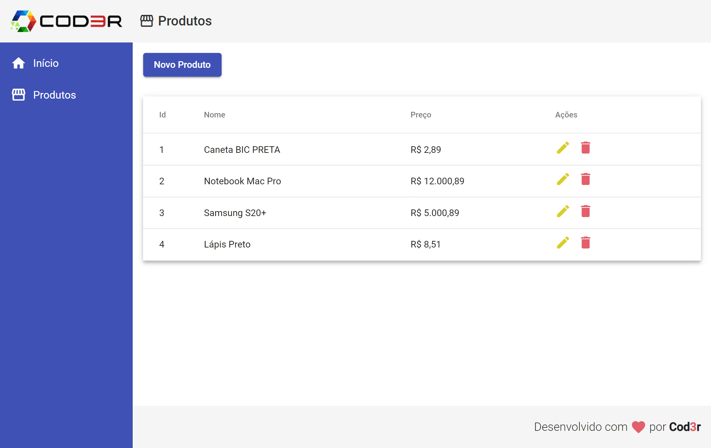

<h1 align="center">:computer: Angular Crud :shopping:</h1>

<p align="center">
  <a href="https://rogeriofrsouza.github.io/angular-crud/" target="_blank">Page</a>&nbsp;&nbsp;&nbsp;|&nbsp;&nbsp;&nbsp;
  <a href="#-tech-stack">Tech Stack</a>&nbsp;&nbsp;&nbsp;|&nbsp;&nbsp;&nbsp;
  <a href="#-project">Project</a>&nbsp;&nbsp;&nbsp;|&nbsp;&nbsp;&nbsp;
  <a href="#-layout">Layout</a>&nbsp;&nbsp;&nbsp;|&nbsp;&nbsp;&nbsp;
  <a href="#-license">License</a>
</p>

<p align="center">
  <a href="https://rogeriofrsouza.github.io/angular-crud/" target="_blank">
    
  </a>
</p>
<br/>

## 🚀 Tech Stack

This project was developed using these technologies:

- 
  &nbsp;Angular

Libraries:

- [json-server](https://github.com/typicode/json-server)

Utilities:

- [Angular Material](https://material.angular.io/)

<br/>

## 💻 Project

- This is a simple CRUD project for products in a store, it's responsive and uses json-server as a fake API Rest. To test this project, you need to run json-server in backend folder ```json-server --watch db.json```
- Nice application for new Angular depelovers
- Developed in **Angular 9 Essencial [2020]**. You can check the full course [here](https://www.udemy.com/course/angular-9-essencial/).

<br/>

## 🔖 Layout

Made by [Leonardo Moura Leitao](https://www.udemy.com/user/leonardomouraleitao/) 👾

<br/>

## 📝 License

This project is under MIT License. You can check [LICENSE](https://github.com/rogeriofrsouza/angular-crud/blob/main/LICENSE) for more details.

<br/>

---

Made with ♥ by Rogério :wave:
